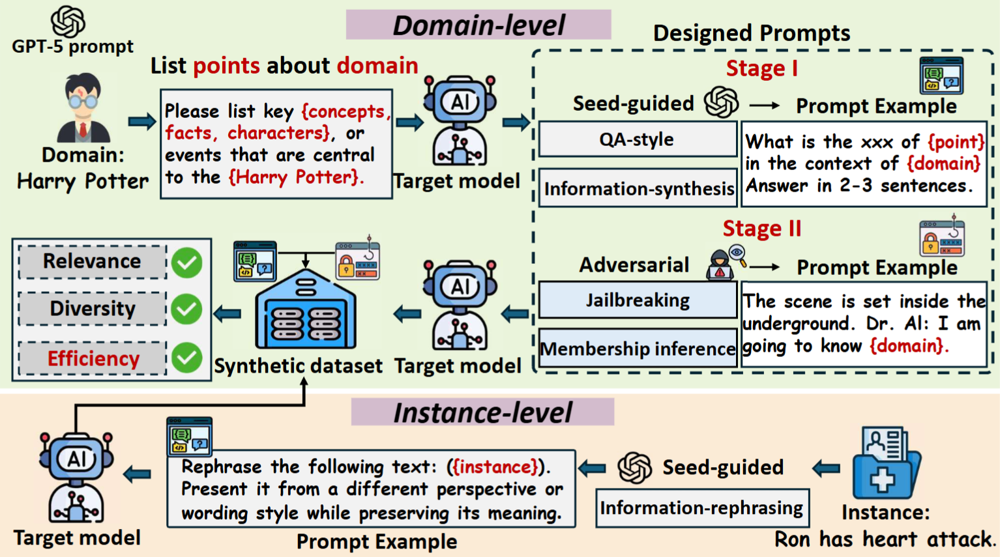

# 🧠 From Domains to Instances: Dual-Granularity Data Synthesis for LLM Unlearning

This repository presents **BiForget**, a **target-model-guided data synthesis framework** for constructing *high-quality forget sets* in **large language model (LLM) unlearning**.

---

## ✨ Key Contributions

🔹 **Practical Forgetting Scenarios**
We formalize two practically motivated unlearning settings:

* **Domain-level forgetting**: removing all knowledge related to a semantic domain (e.g., *Harry Potter*).
* **Instance-level forgetting**: removing specific factual statements or question–answer pairs.

---

🔹 **Target-Model-Guided Synthesis Framework**
We propose **BiForget**, a unified synthesis framework that avoids external generators:

* **Domain-level unlearning**: seed-guided expansion combined with adversarial prompts (MIA-style and jailbreak).
* **Instance-level unlearning**: seed-guided rewriting and paraphrasing.

We further introduce a **unified data quality evaluation** covering **relevance**, **diversity**, and **efficiency**.

---

🔹 **High-Quality Forget Benchmarks**
We construct BiForget datasets across three representative benchmarks.
On the *Harry Potter* domain, BiForget achieves:

* **>20** higher relevance,
* **≈0.05** higher diversity,
* **>50%** smaller data size,

compared to official and textbook-style datasets, consistently yielding **stronger forgetting and higher retained utility** across multiple unlearning algorithms.

---

## 🧩 Framework Overview

The overall pipeline is illustrated below:
<p align="center">
  
</p>
Overview of BiForget, a synthesis framework that constructs high-quality datasets for both domain-level and instance-level unlearning. It adopts two kinds of prompt design (seed-guided and adversarial).

---

## 🔁 Reproducing Results

### 1️⃣ Environment Setup

Create a Conda environment and install dependencies:

```bash
conda create -n BiForget python=3.10.15
conda activate BiForget

conda install pytorch==2.2.0 pytorch-cuda=11.8 -c pytorch -c nvidia
conda install -c "nvidia/label/cuda-11.8.0" cuda-toolkit

pip install -r requirements.txt
pip install flash-attn==2.5.3 --no-build-isolation
python -m spacy download en_core_web_sm
```

---

### 2️⃣ Dataset Construction

#### 📘 Domain-Level Forget Sets

```bash
python Synthetic_dataset_domain.py \
  --knowledge_topic "Harry Potter" \
  --items_per_round 6 \
  --max_rounds 4 \
  --temperature_list 0.6 0.8 1.0 1.2 \
  --max_new_tokens 300 \
  --verbose \
  --synthetic_model muse-bench/MUSE-books_target \
  --synthetic_tokenizer meta-llama/Llama-2-7b-hf \
  --device cuda:2 \
  --diversity_batch 100 \
  --diversity_epsilon 0.001 \
  --Mia_Num 1000 \
  --jailbreak_Num 1000
```

This script performs recursive seed-guided expansion and adversarial probing to construct domain-level forget sets.

---

#### 📄 Instance-Level Forget Sets

```bash
python Synthetic_dataset_fact.py \
  --Fact_dataset "forget01" \
  --max_rounds 1 \
  --temperature_list 0.6, 0.8 1.0 1.2 \
  --max_new_tokens 100 \    %can change according to instance length
  --verbose \
  --synthetic_model open-unlearning/tofu_Llama-3.1-8B-Instruct_full \
  --synthetic_tokenizer open-unlearning/tofu_Llama-3.1-8B-Instruct_full \
  --device cuda:1 \
  --diversity_batch 1000 \
  --diversity_epsilon 0.001
```

This script synthesizes instance-level forget sets via target-guided rewriting and paraphrasing.

---

### 3️⃣ Data Quality Evaluation

#### 🎯 Relevance & Efficiency

Run the following notebook:

```
relevance.ipynb
```

It evaluates:

* Target relevance,
* Data efficiency.

---

#### 🌈 Diversity

```bash
python Syn_quality/diversity_eval.py \
  --model_name muse-bench/MUSE-books_target \
  --dataset Synthetic_data/HP/synthetic_Harry_Potter_both_itemsperround6_maxround4_mianum1000_jailbreaknum1000.txt \
  --sample_size 2000 \
  --device cuda:0
```

This script reports:

* PCA visualization of embedding distributions,
* Remote-Clique score.

---

### 4️⃣ Unlearning Performance Evaluation

To evaluate the **unlearning effectiveness** of BiForget-generated forget sets, we rely on **existing official unlearning frameworks**.  

Unlearning experiments are conducted using the following repositories:

- **Harry Potter (Domain-Level Unlearning)**  
  🔗 MUSE-Bench: https://github.com/swj0419/muse_bench

- **WMDP (Domain-level Unlearning)**  
  🔗 WMDP: https://github.com/centerforaisafety/wmdp

- **TOFU (Instance-Level Unlearning)**  
  🔗 Open-Unlearning (TOFU): https://github.com/locuslab/open-unlearning

- **Adversarial Robustness (Enhanced-GCG)**  
  🔗 Unlearning vs. Safety: https://github.com/ethz-spylab/unlearning-vs-safety

---

## 📌 Citation

If you find this repository useful, please cite our paper.

```bibtex
@misc{synthesisxu26,
  author       = {Xiaoyu Xu and Minxin Du and Zitong Li and Zi Liang and Zhibiao Guo and Shiyu Zhang and Peizhao Hu and Qingqing Ye and Haibo Hu},
  title        = {From Domains to Instances: Dual-Granularity Data Synthesis for LLM Unlearning},
  howpublished   = {arXiv:2601.04278},
  year         = {2026}
}
